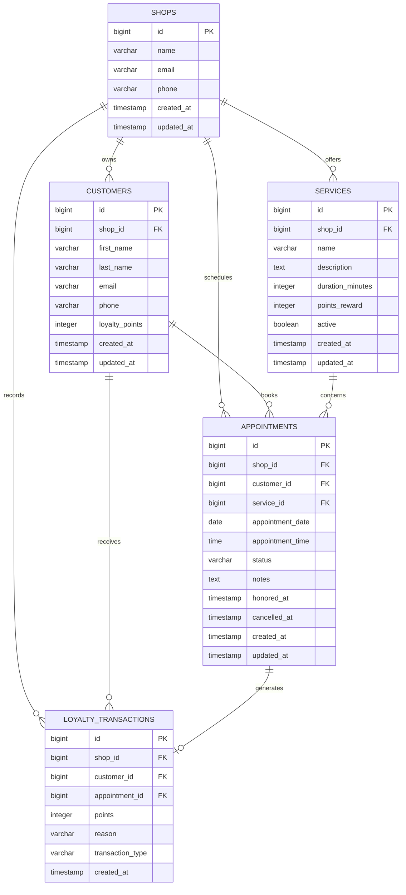

# Schéma de Base de Données

Ce fichier source décrit le modèle relationnel des modules Clients, Rendez-vous et Fidélisation.

Le livrable final attendu par l'étude de cas est `bdd/schema base de données.pdf`. Ce fichier Markdown sert de source textuelle versionnée pour générer ou vérifier ce PDF.

## Règles Métier

- Le commerce de démonstration est "Chez Marie".
- Un client appartient au commerce "Chez Marie".
- Un email client est unique pour un commerce.
- Un rendez-vous concerne un client, un service, une date et une heure.
- Les statuts de rendez-vous sont `SCHEDULED`, `HONORED` et `CANCELLED`.
- Lorsqu'un rendez-vous passe à `HONORED`, une transaction de fidélité `EARNED` de 100 points est créée.
- Le solde du client est stocké dans `customers.loyalty_points` et l'historique est stocké dans `loyalty_transactions`.
- Les données de test sont anonymisées et utilisent des adresses email d'exemple.
